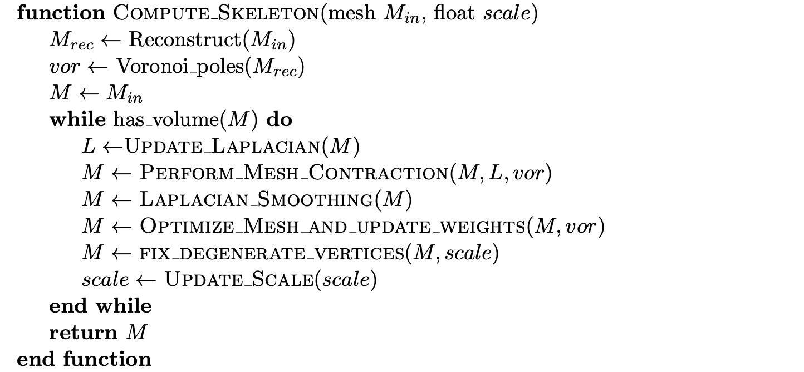

# UCL-APG-Project
COMP0119: Acquisition and Processing of 3D Geometry Project

A realization of Mean Curvature Skeleton

> **Reference:** Tagliasacchi, A., Alhashim, I., Olson, M. and Zhang, H. (2012), Mean Curvature Skeletons. Computer Graphics Forum, 31: 1735-1744. https://doi.org/10.1111/j.1467-8659.2012.03178.x

## Examples

|  |  |  |
| ------------------------------------------------------------ | ------------------------------------------------------------ | ------------------------------------------------------------ |

|  |  |  |
| ------------------------------------------------------------ | ------------------------------------------------------------ | ------------------------------------------------------------ |

|  |  |  |
| ------------------------------------------------------------ | ------------------------------------------------------------ | ------------------------------------------------------------ |

|  |  |  |
| ------------------------------------------------------------ | ------------------------------------------------------------ | ------------------------------------------------------------ |

|  |  |  |
| ------------------------------------------------------------ | ------------------------------------------------------------ | ------------------------------------------------------------ |

|  |  |  |
| ------------------------------------------------------------ | ------------------------------------------------------------ | ------------------------------------------------------------ |

|  |  |  |
| ------------------------------------------------------------ | ------------------------------------------------------------ | ------------------------------------------------------------ |

|  |  |  |
| ------------------------------------------------------------ | ------------------------------------------------------------ | ------------------------------------------------------------ |

|  |  |  |
| ------------------------------------------------------------ | ------------------------------------------------------------ | ------------------------------------------------------------ |

## How to use

*If you want, you can adjust the parameters in `src/config.json`.*

```Python
# Assuming you are in the root of project
from src.msf import MSF

# Initial a MSF Instance
msf = MSF()

# Load a mesh
msf.load_mesh("../models/armadillo.obj")

# Let's iterate! Of course you should repeate it.
msf.iterate()

# Then see the skeletons in the latest folder of the `result` folder.
```

## Parameter Explaination
*Set the parameters in `src/config.json`*

+ `wL`: wL in the paper;

+ `wH`: wL in the paper;

+ `wM`: wL in the paper;

+ `use_dynamic_scale`: If `true`, then allow adjusting `scale` between iterations. The `scale` will change between `scale_min` and `scale_max` repeatedly at intervals of `scale_delta`, which can speed up convergence;

+ `scale`: The $\varepsilon$ in the paper will be scale multiply the diagonal length of the mesh's bounding box;

+ `scale_min`: Only be used when `use_dynamic_scale=true`;

+ `scale_delta`: Only be used when `use_dynamic_scale=true`;

+ `scale_max`: Only be used when `use_dynamic_scale=true`;

+ `scale_fix`: Be used to fix vertices;

+ `alpha`: The $\theta$ in the paper;

+ `use_Laplacian_smoothing`: If `true`, then use Implicit Laplacian smoothing before mesh optimizing, which is critical to produce a complete skeleton instead of meso-skeleton;

+ `smooth_lam`: $\lambda$ in the Implict Laplacian Smoothing (step size);

+ `smooth_it`: The iteration number of the Implict Laplacian Smoothing;

+ `use_reconstruction_in_voronoi`: If `true`, use mesh reconstruction before calculating Voronoi poles, which can produce a better approximation of medial axis;

+ `k_voronoi:, Parameter in mesh reconstruction, only be used when `use_reconstruction_in_voronoi=true`, which means using the eigen vectors corresponding to the `k_voronoi` smallest eigen values to perform reconstruction;

+ `use_reconstruction_in_skeletonization`: If `true`, use reconstructed mesh in skeletonization, which can ignore details on the mesh that do not contribute to the skeletonization;

+ `k_skeleton`: As `k_voronoi`, only be used when `use_reconstruction_in_skeletonization=true`;

+ `lsqr_args`: Parameters for `scipy.sparse.linalg.lsqr`. Generally not modified.

## Algorithm Procedure Code
